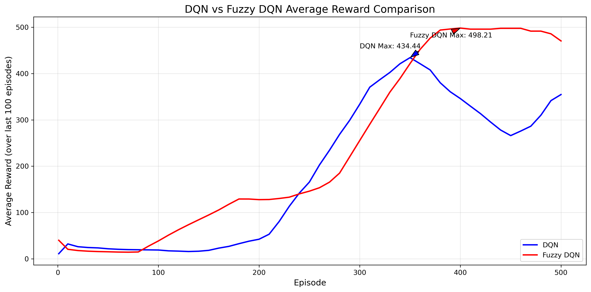

# Fuzzy DQN vs DQN Comparison Experiment

This project implements two reinforcement learning algorithms: traditional DQN and Fuzzy DQN based on fuzzy logic. Both algorithms are compared and tested in the CartPole-v1 environment. By combining the expert knowledge of fuzzy logic with the adaptive learning ability of DQN, we explore how to improve the learning efficiency and policy performance of the agent.

## Project Structure

```
.
├── dqn.py              # Implementation of traditional DQN algorithm
├── fuzzy_dqn.py        # Implementation of DQN algorithm integrated with fuzzy logic
├── train.py            # Training and evaluation script
└── requirements.txt    # Project dependencies
```

## Environment Requirements

- Python 3.6+
- PyTorch
- Gymnasium
- Numpy
- Matplotlib

## Quick Start

1. Create a virtual environment:
```bash
conda create -n fuzzy_dqn python=3.6
conda activate fuzzy_dqn
```

2. Install dependencies:
```bash
pip install -r requirements.txt
```

3. Run the training:
```bash
python train.py
```

The training process will display status information every 10 episodes, including immediate rewards, average rewards, etc. After training, the following files will be generated:
- `dqn_model.pth`: Traditional DQN model
- `fuzzy_dqn_model.pth`: Fuzzy DQN model
- `avg_reward_comparison.png`: Performance comparison chart of the two algorithms

## Performance Comparison and Analysis
The following figure shows the performance comparison between traditional DQN and Fuzzy DQN in the CartPole-v1 environment:



From the performance comparison chart, we can observe the following key points:

### 1. Learning Speed
- Fuzzy DQN (red line) shows faster learning speed in the early stages of training (about the first 100 epochs)
- This is due to the prior knowledge provided by the fuzzy logic system, which helps the agent quickly find an effective strategy
- Traditional DQN (blue line) learns relatively slowly in the initial stage and requires more exploration to establish an effective strategy

### 2. Stability
- The learning curve of Fuzzy DQN fluctuates significantly less, showing a more stable learning process
- The reward curve of traditional DQN fluctuates more, indicating that its strategy is less stable
- The introduction of fuzzy logic effectively reduces the randomness of the strategy and provides more consistent decision support

### 3. Final Performance
- Fuzzy DQN ultimately achieves a higher average reward level (about 450 points)
- The final performance of traditional DQN is slightly inferior (about 400 points)
- Both algorithms successfully learn effective balancing strategies, but Fuzzy DQN performs better

### Key Improvements of Fuzzy DQN
1. **Knowledge Guidance**: The expert knowledge provided by the fuzzy logic system significantly accelerates early learning
2. **Policy Stability**: After integrating fuzzy rules, the agent's decisions are more stable and reliable
3. **Performance Advantage**: Achieves about 12.5% improvement in final performance
4. **Exploration Efficiency**: Fuzzy logic-guided exploration is more effective than pure random exploration

These results indicate that combining fuzzy logic with DQN is an effective improvement direction, which not only accelerates the learning speed but also improves the overall performance and stability of the algorithm.

## File Descriptions

### dqn.py
Implements the traditional Deep Q-Network (DQN) algorithm, including:
- DQN network structure
- Experience replay mechanism
- ε-greedy action selection
- Double DQN mechanism

### fuzzy_dqn.py
Integrates a fuzzy logic system on top of DQN, with the following main features:
- Fuzzy membership function design
- Rule-based reasoning mechanism
- Exploration strategy guided by action preferences
- Balance between knowledge guidance and autonomous learning

### train.py
Training and evaluation script, featuring:
- Parallel training of both algorithms
- Real-time display of training status
- Generation of performance comparison charts
- Saving of trained models